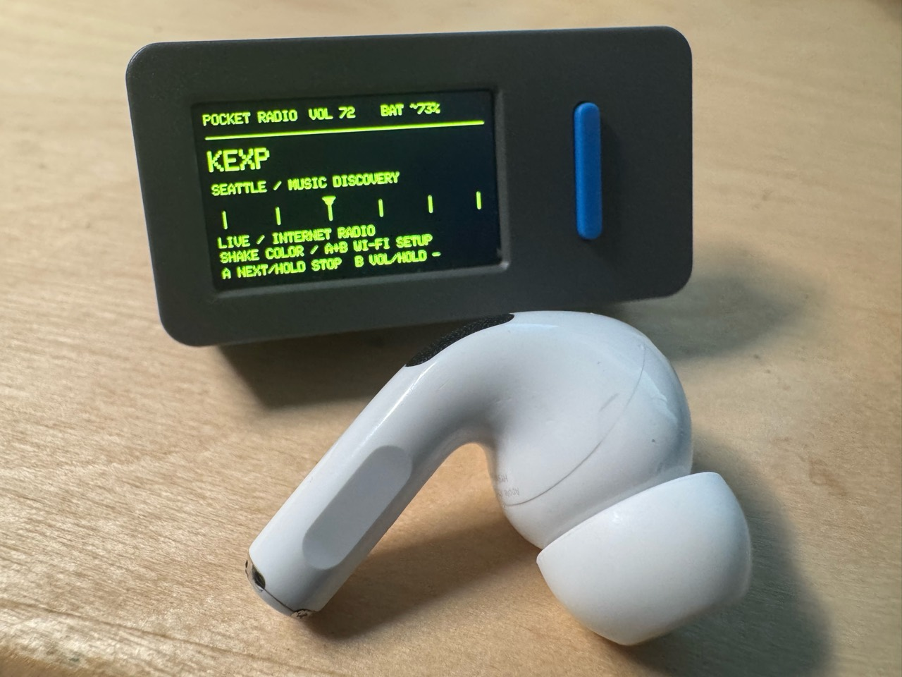
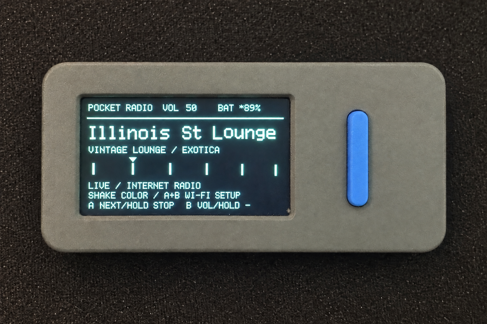
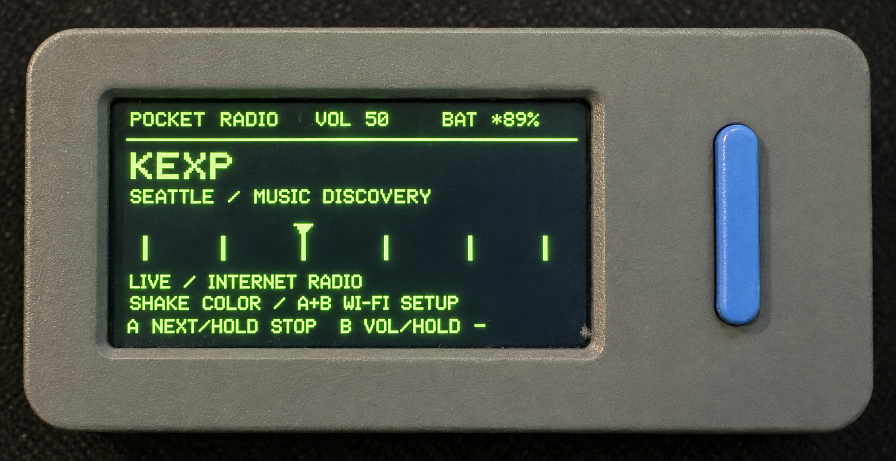
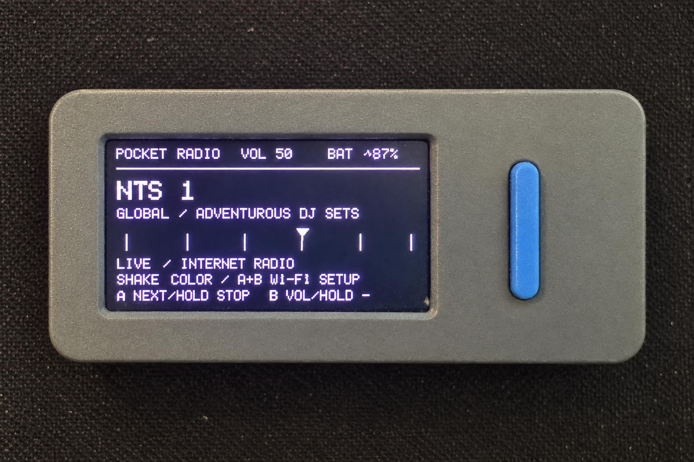
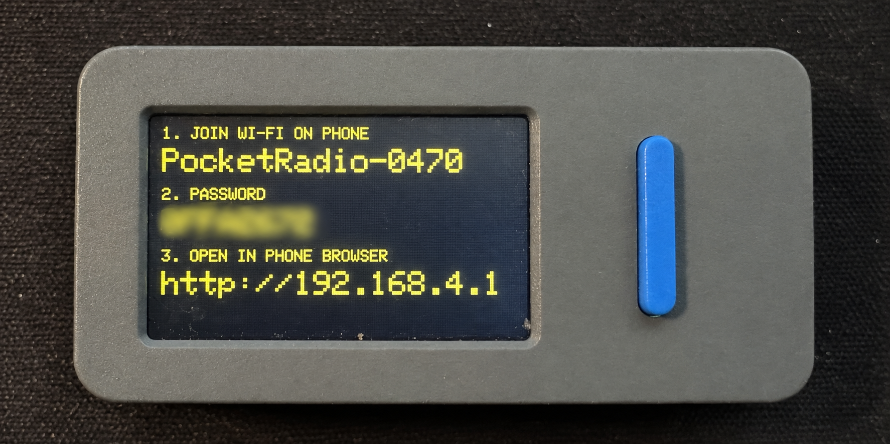
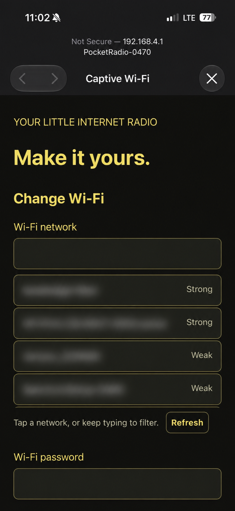
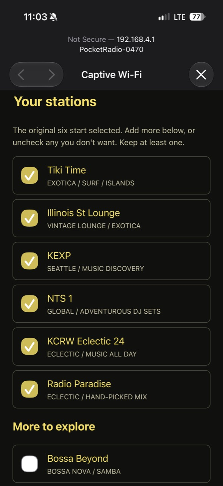
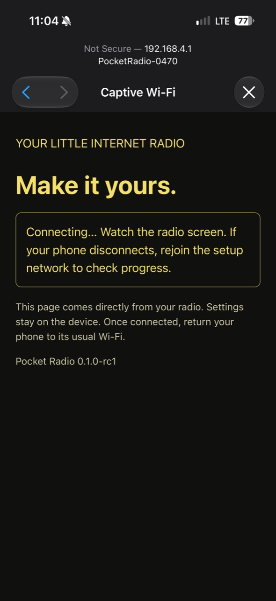

# Pocket Radio

A tiny internet radio for the **M5Stack StickS3**. Listen through the built-in speaker, choose your stations from a phone, and shake the radio to change its monochrome color.



**Version 0.1.0:** [Download firmware and source](https://github.com/bruceblay/pocket-radio/releases/tag/v0.1.0). Clean installation through M5Burner, phone Wi-Fi setup, and playback have been confirmed on a StickS3. M5Burner public review is pending.

## Features

- Phone-based Wi-Fi setup with nearby network suggestions; no credentials in source code.
- Ten station choices, with six selected by default: Tiki Time, Illinois Street Lounge, KEXP, NTS 1, KCRW Eclectic 24, and Radio Paradise.
- Optional Bossa Beyond, Secret Agent, Suburbs of Goa, and Heavyweight Reggae.
- Saved station selection and color, play/stop controls, volume adjustment, and approximate battery readout.

## On the device and your phone

Shake to change the monochrome color:

<p>
  
  
  
</p>

The radio displays the details for joining its setup network. Your phone handles Wi-Fi selection and station choices.



<p>
  
  
  
</p>

Device photos are cropped; the setup password and nearby Wi-Fi names are obscured.

## Build and try it

Use a StickS3, a USB-C data cable, and a 2.4 GHz Wi-Fi network with internet access. This firmware does not run directly on the older StickC family and cannot send audio to Bluetooth speakers.

```sh
python3 -m venv .venv
.venv/bin/pip install platformio==6.2.0
.venv/bin/pio run -d projects/pocket-radio
.venv/bin/pio run -d projects/pocket-radio -t upload --upload-port YOUR_DEVICE_PORT
```

Uploading replaces the device's current app. For upload mode, connect USB and hold the side reset button until the green LED flashes. After flashing, join the PocketRadio Wi-Fi network shown on the device using its displayed password. Open **http://192.168.4.1/** on your phone and connect the radio to your home Wi-Fi.

Tap **A** to change stations; hold A to stop/resume. Tap **B** for volume up; hold B for volume down. Hold **A+B for 1.5 seconds** to reopen setup. **Double-click the separate side power/reset button to power off.**

See the [full setup, controls, limitations, and test instructions](projects/pocket-radio/README.md).

## Development

The firmware lives in `projects/pocket-radio/`; shared research and release notes live in `docs/`. Build checks run on pushes and pull requests. Please report playback issues with the station, firmware version, power source, and relevant diagnostics—never Wi-Fi passwords or device flash dumps.

## Credits and licensing

The speaker adapter is based on [M5Stack's web-radio example](https://github.com/m5stack/M5Unified/blob/master/examples/Advanced/WebRadio_with_ESP8266Audio/WebRadio_with_ESP8266Audio.ino); its MIT notice is retained. Audio decoding uses ESP8266Audio and libmad. Stations stream directly from their broadcasters; support the stations you enjoy.

Original Pocket Radio code is licensed under [GPL-3.0-or-later](LICENSE). Third-party components retain their respective licenses and notices. See the [distribution license review](docs/license-review.md) for dependency details.
